# Actividad 5 - Proyecto de Login

## Portada

**Proyecto:** Sistema de Login y Panel de Usuario
**Materia / Actividad:** Actividad 5

**Integrantes del equipo:**
<!-- Reemplazar con los nombres de los alumnos del equipo -->
- José Daniel Cruz Barrera - 23160879
- David Efraín José Ramos - 23160972
<!-- Agregar o quitar filas según el número de integrantes -->

**Descripción breve:**
Sistema web de dos pantallas: una pantalla de acceso (`login.html`) que valida las credenciales del usuario, y una pantalla principal (`index.html`) que simula un panel de sistema con sidebar y navbar, donde se captura información adicional de usuarios y alumnos. El proyecto se desarrolla con HTML, CSS y JavaScript puro, y utiliza `localStorage` como medio de almacenamiento de datos.

## Tabla de Contenidos

- [Descripción General](#descripción-general)
- [Tecnologías Utilizadas](#tecnologías-utilizadas)
- [Estructura del Proyecto](#estructura-del-proyecto)
- [Flujo del Proyecto](#flujo-del-proyecto)
- [Estructura Visual de index.html](#estructura-visual-de-indexhtml)
- [Funcionalidades](#funcionalidades)
- [La Librería utileria.js](#la-librería-utileriajs)
- [Métodos Principales](#métodos-principales)
- [Cómo se Pasa el Usuario del Login al Navbar](#cómo-se-pasa-el-usuario-del-login-al-navbar)
- [Proceso de Creación Paso a Paso](#proceso-de-creación-paso-a-paso)
- [Instalación y Uso](#instalación-y-uso)
- [Capturas de Pantalla](#capturas-de-pantalla)
- [Notas y Trabajo Futuro](#notas-y-trabajo-futuro)

## Descripción General

El proyecto está dividido en dos pantallas conectadas entre sí, en lugar de tener toda la funcionalidad en una sola página:

- **`login.html`**: pantalla de acceso al sistema. Contiene el formulario de correo y contraseña, validado con JavaScript. La validación es simulada (no requiere backend ni base de datos real); al pasar la validación, el usuario es redirigido a `index.html`.
- **`index.html`**: pantalla principal del sistema, a la que se llega una vez "dentro" tras iniciar sesión. Incluye un sidebar (menú lateral) y un navbar (barra superior), además de la funcionalidad de captura de usuarios y alumnos.

También se conserva `registro.html`, utilizado para dar de alta las cuentas con las que posteriormente se inicia sesión en `login.html`.

## Tecnologías Utilizadas

- **HTML5**: estructura de las páginas.
- **CSS3 puro**: estilos y diseño responsivo mediante variables CSS, sin frameworks externos como Bootstrap o Tailwind. Se optó por mantener el mismo enfoque de CSS puro utilizado en el resto del proyecto (`login.html` y `registro.html`), en lugar de introducir un framework de estilos adicional.
- **JavaScript (Vanilla JS)**: lógica de validación, manipulación del DOM, manejo del sidebar/navbar y manejo de `localStorage`.
- **[SweetAlert2](https://sweetalert2.github.io/)**: librería utilizada para mostrar alertas y mensajes emergentes estilizados (cargada mediante CDN).

## Estructura del Proyecto

```
Proyecto-Login/
├── css/
│   ├── style.css        # Estilos generales de login y registro
│   └── index.css        # Estilos del panel principal: sidebar, navbar y contenido
├── img/                  # Recursos gráficos del proyecto
├── js/
│   ├── utileria.js       # Librería de funciones de validación reutilizables
│   ├── login.js          # Lógica del formulario de inicio de sesión
│   ├── registro.js       # Lógica del formulario de registro
│   └── index.js          # Lógica del panel principal: sidebar, navbar, captura de usuarios y alumnos
├── index.html            # Panel principal del sistema (sidebar + navbar)
├── login.html             # Formulario de inicio de sesión
├── registro.html          # Formulario de registro de usuario
└── README.md
```

> **Nota:** Los campos capturados en los formularios (tanto en `registro.html` como en el submenú **Captura** de `index.html`) pueden modificarse de acuerdo con las necesidades del proyecto; la estructura actual es un punto de partida y no una lista cerrada de campos.

## Flujo del Proyecto

1. El usuario abre `login.html` e ingresa su correo y contraseña.
2. Los campos se validan en tiempo real con las funciones `validarCorreo` y `validarPassword` de `utileria.js`.
3. Al enviar el formulario, si la validación es correcta (de forma simulada, sin backend), el usuario es redirigido a `index.html`.
4. En `index.html`, el nombre o correo del usuario que inició sesión se muestra en el navbar.
5. Desde el sidebar, el usuario puede navegar al menú **Usuarios > Captura** para registrar nuevos usuarios o alumnos.
6. Al dar clic en el nombre de usuario del navbar, se despliega un menú con la opción **Salir del sistema**, que redirige nuevamente a `login.html`, simulando el cierre de sesión.

## Estructura Visual de index.html

### Sidebar (menú lateral)

- Botón tipo hamburguesa para abrir y cerrar el sidebar.
- Opción **Usuarios**, con submenú desplegable **Captura**.

### Navbar (barra superior)

- Muestra, en la parte derecha, el nombre (o correo) del usuario que inició sesión.
- Al dar clic sobre el nombre, se despliega un menú con la opción **Salir del sistema**, que regresa a `login.html`.

## Funcionalidades

### Login (`login.html`)

- Captura de correo electrónico y contraseña.
- Validación en tiempo real mediante `validarCorreo` y `validarPassword`.
- Comparación de credenciales contra los usuarios almacenados en `localStorage`.
- Alertas mediante SweetAlert2 en caso de credenciales o formato incorrectos.
- Redirección a `index.html` cuando el inicio de sesión es exitoso.

### Menú Usuarios > Captura (`index.html`)

- Formulario con nombre de usuario, correo electrónico y contraseña.
- Validado con `validarCorreo` y `validarPassword`.

### Formulario de alumnos (`index.html`)

- Incluye los campos base de captura, más un campo de **número de control**, validado con `validarLongitud` para exigir exactamente 6 dígitos.
- Incluye fecha de nacimiento, la cual se utiliza para el modal de edad.

### Modal de edad

- Al capturar la fecha de nacimiento del alumno, se calcula la edad con `calcularEdad` y se valida con `esMayorDeEdad`.
- El modal muestra al usuario si el alumno es mayor o menor de edad.

### Navbar con nombre de usuario

- Muestra el nombre o correo capturado en `login.html`.
- Incluye un menú desplegable con la opción de cerrar sesión, que redirige a `login.html`.

## La Librería utileria.js

El archivo `js/utileria.js` funciona como una pequeña **librería de validaciones**, ya que no está atada a un formulario en particular, sino que expone funciones genéricas que pueden reutilizarse en distintas partes del proyecto. Estas funciones fueron creadas originalmente en un trabajo anterior del equipo y se reutilizan aquí tanto en `login.html`, `registro.html`, como en el panel principal `index.html`, evitando duplicar lógica de validación.

| Función | Descripción |
|---|---|
| `validarCorreo` | Verifica que el correo tenga un formato válido. |
| `soloLetras` | Verifica que un texto contenga únicamente letras y espacios (incluye acentos y ñ). |
| `validarLongitud` | Verifica que un valor no exceda (o cumpla) una longitud determinada; se utiliza, entre otros casos, para validar el número de control de 6 dígitos. |
| `validarPassword` | Verifica que la contraseña tenga mínimo 8 caracteres, incluyendo mayúscula, minúscula, número y carácter especial. |

## Métodos Principales

Además de las funciones de validación de `utileria.js`, el proyecto se apoya en los siguientes métodos, repetidos en distintos archivos JS:

```javascript
// Obtiene el arreglo de usuarios almacenado, o un arreglo vacío si no existe
const obtenerUsuarios = () =>
    JSON.parse(localStorage.getItem("usuarios")) || [];

// Guarda el arreglo de usuarios actualizado en localStorage
const guardarUsuarios = (usuarios) =>
    localStorage.setItem("usuarios", JSON.stringify(usuarios));
```

- **`obtenerUsuarios` / `guardarUsuarios`**: usados en `registro.js` y `login.js` para leer y escribir el arreglo de usuarios en `localStorage`.
- **`marcarEstado`**: función auxiliar que agrega o quita las clases `valido` / `invalido` a un campo, según el resultado de su validación, para dar retroalimentación visual inmediata.

## Cómo se Pasa el Usuario del Login al Navbar

<!-- Ajustar esta sección según la implementación final en el código -->

Cuando el login es exitoso, además de redirigir a `index.html`, se guarda una referencia del usuario que inició sesión para que pueda mostrarse en el navbar. La forma recomendada de hacerlo, siguiendo el mismo patrón que ya usa el proyecto con `localStorage`, es:

```javascript
// Al iniciar sesión correctamente en login.js
localStorage.setItem("usuarioActual", JSON.stringify(usuarioEncontrado));
window.location.href = "index.html";
```

```javascript
// Al cargar index.js
const usuarioActual = JSON.parse(localStorage.getItem("usuarioActual"));
document.getElementById("nombreUsuarioNavbar").textContent = usuarioActual.nombre || usuarioActual.correo;
```

Y al cerrar sesión desde el navbar:

```javascript
localStorage.removeItem("usuarioActual");
window.location.href = "login.html";
```

Esto permite que `index.html` sepa quién inició sesión sin necesidad de un backend, y que al salir del sistema se limpie esa referencia.

## Proceso de Creación Paso a Paso

<!-- Completar cada paso con una breve descripción de cómo se realizó y agregar la captura correspondiente -->

1. **Login**: se partió del formulario de `login.html` ya existente, agregando la validación con `validarCorreo` y `validarPassword`, y la redirección a `index.html` al pasar la validación.
   - Captura: <!-- Insertar captura aquí -->

2. **Sidebar**: se creó el menú lateral con el botón hamburguesa para mostrarlo/ocultarlo, y la opción **Usuarios** con su submenú **Captura**.
   - Captura: <!-- Insertar captura aquí -->

3. **Navbar con usuario**: se agregó la barra superior, mostrando el nombre del usuario autenticado y su menú desplegable con la opción de salir del sistema.
   - Captura: <!-- Insertar captura aquí -->

4. **Número de control**: se añadió el campo de número de control al formulario de alumnos, validado con `validarLongitud` para exigir 6 dígitos.
   - Captura: <!-- Insertar captura aquí -->

5. **Modal de edad**: se integró el modal que indica si el alumno es mayor o menor de edad, utilizando `calcularEdad` y `esMayorDeEdad`.
   - Captura: <!-- Insertar captura aquí -->

## Instalación y Uso

1. Clona el repositorio:
   ```bash
   git clone https://github.com/osmards2003-commits/Actividad-5_Proyecto-de-login.git
   ```
2. Abre la carpeta del proyecto.
3. Abre `registro.html` para crear un usuario nuevo (si aún no existe uno).
4. Abre `login.html` e ingresa con las credenciales registradas.
5. Al validarse correctamente, serás redirigido a `index.html`, donde podrás navegar por el sidebar y capturar usuarios/alumnos desde el menú **Usuarios > Captura**.

> No se requiere instalación de dependencias ni un servidor local, ya que el proyecto funciona directamente en el navegador. La única dependencia externa (SweetAlert2) se carga mediante un CDN.

## Capturas de Pantalla

<!-- Agregar las capturas de pantalla del flujo completo funcionando -->

### Login
<!-- Insertar captura aquí -->
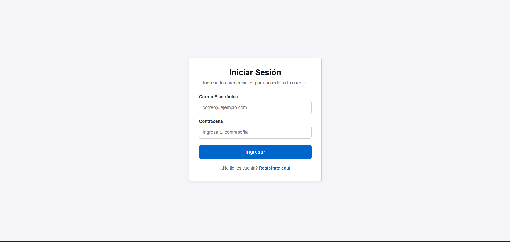

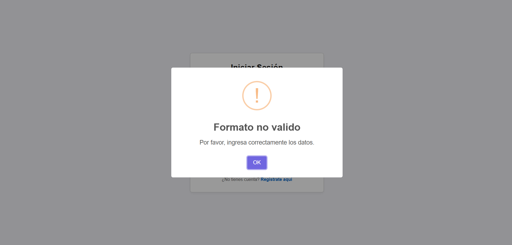

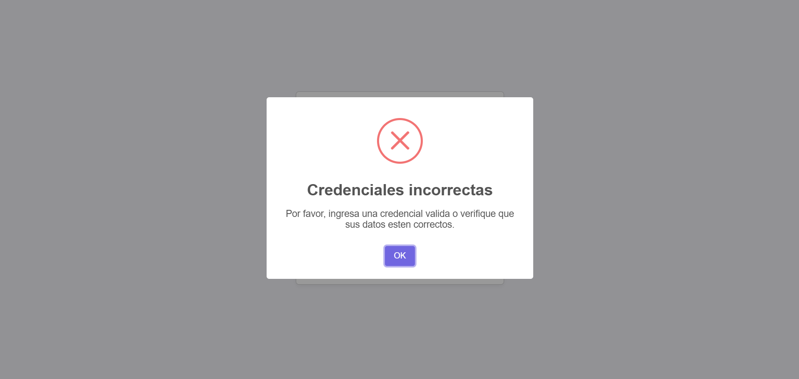

### Sidebar abierto / cerrado
<!-- Insertar captura aquí -->

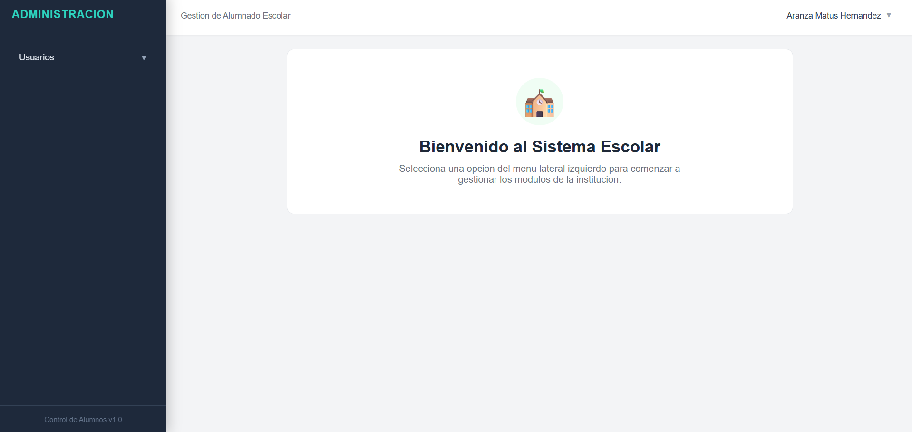

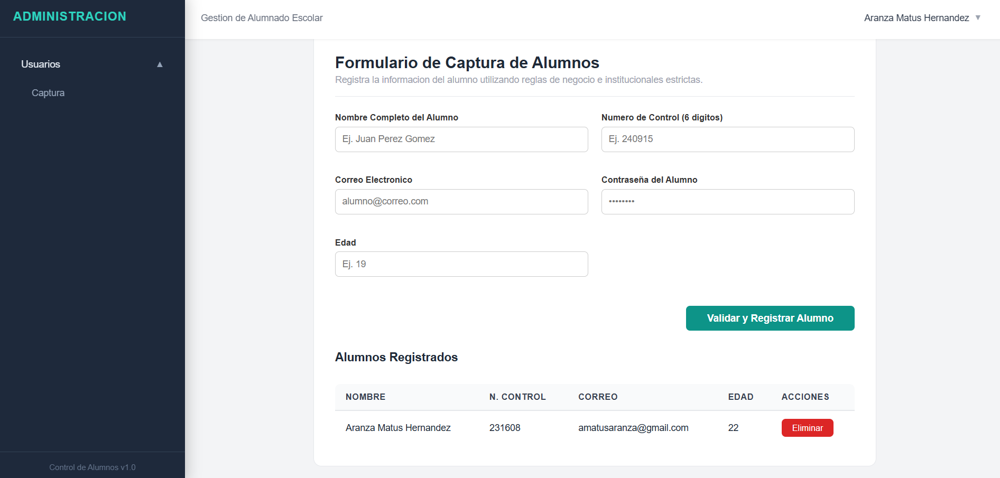

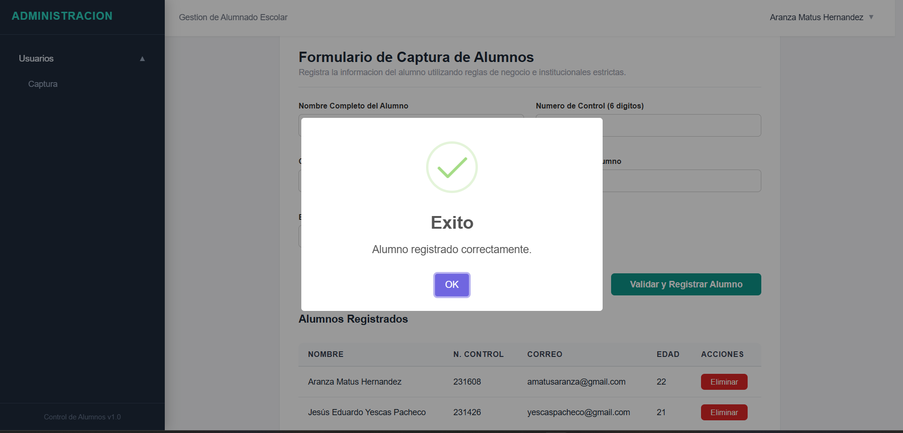

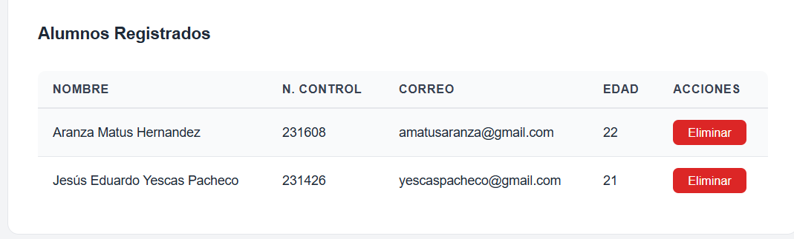

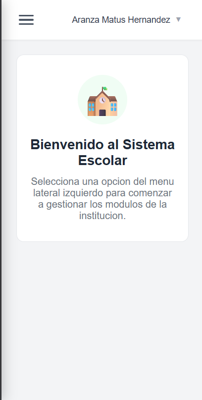

### Navbar con nombre de usuario y menú de salir
<!-- Insertar captura aquí -->
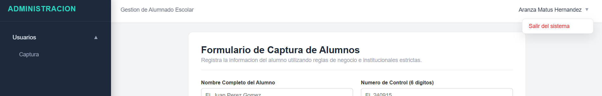

### Formulario de alumnos con número de control
<!-- Insertar captura aquí -->


### Registro
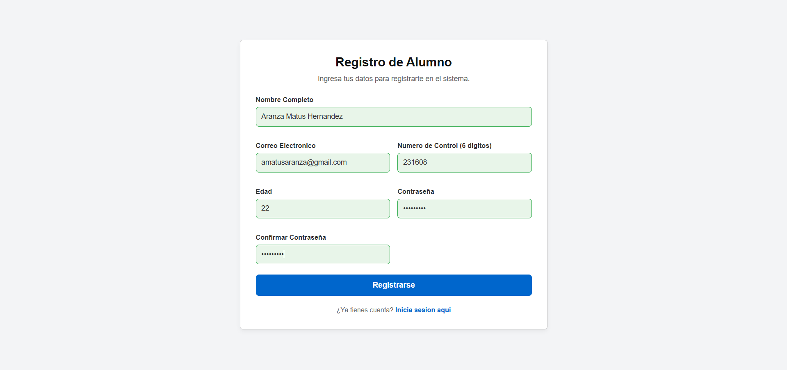

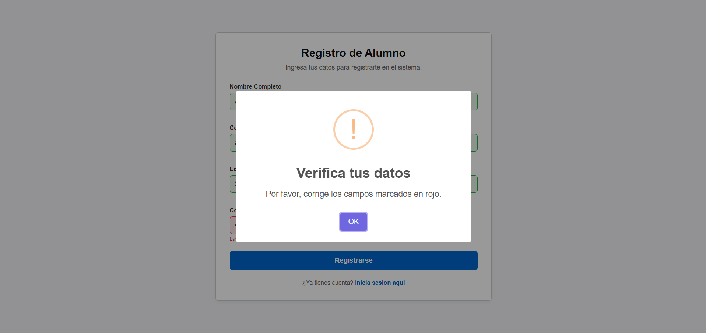

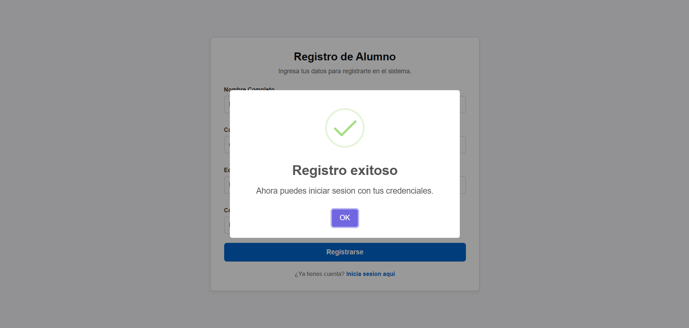

## Notas y Trabajo Futuro

- Los campos de los formularios de captura (usuarios y alumnos) pueden ajustarse o ampliarse según las necesidades del proyecto; la estructura actual es solo una base.
- La validación del login es simulada mediante JavaScript y `localStorage`; no existe un backend ni una base de datos real detrás del sistema.
- Se planea reemplazar `localStorage` por una base de datos real en una futura versión del proyecto.
- Se planea reforzar el manejo de la sesión del usuario autenticado (por ejemplo, mediante `sessionStorage` o tokens), en lugar de depender únicamente de una clave en `localStorage`.
